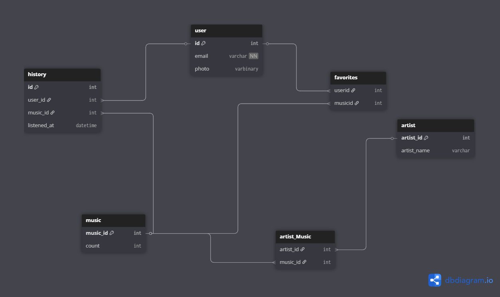

<div align="center">

# 🎶 Moodify — Emotion‑Aware Music & Social API

Build mood‑aware music experiences by combining facial expression recognition with a modern, layered .NET backend.

[](https://dotnet.microsoft.com/) 
[](https://learn.microsoft.com/ef/) 
[](https://www.python.org/) 
[](https://developer.spotify.com/) 
[](#authentication--security)

</div>

## TL;DR (CV‑friendly summary)

- Multi‑project solution: ASP.NET Core API + BAL + DAL + Shared DTOs + a Python model for facial expression inference.
- Features: JWT auth, role seeding, user/friends/favorites, Spotify integration, email notifications, memory caching.
- Built with clean layering: controllers → services (BAL) → EF Core (DAL). Python runs emotion inference from images.
- What I did: designed the architecture, implemented core services, integrated Spotify + email, set up EF migrations and DTOs, and wired in the facial expression model.

---

## Table of contents

- Features
- Architecture
- Tech stack
- Project structure
- Getting started (Windows / PowerShell)
- Configuration
- Run the Python emotion model
- API surface (controllers)
- Screenshots/diagram
- Roadmap
- Contributing
- License

## Features

- Emotion‑aware music: detect facial expressions (PyTorch `best.pt`) and use them to drive music suggestions.
- Spotify integration: token management + music retrieval via service abstractions.
- AuthN/AuthZ: JWT tokens, roles seeding, and protected endpoints.
- Social & personalization: friends, favorites, history entities.
- Email notifications: SMTP‑based email sender for user flows.
- Caching: in‑memory cache utilities to reduce repeat work.

## Architecture

Layered backend with a companion Python component:

- Presentation: ASP.NET Core controllers in `Moodify/Controllers`.
- Business: Services in `Moodify.BAL/Services` behind interfaces (`Moodify.BAL/Interfaces`).
- Persistence: EF Core context/entities in `Moodify.DAL` with migrations.
- ML (auxiliary): `FacialExpression/main.py` loads `best.pt` to classify expressions.

> The Python component is a standalone script (not a web service) in this repo; the API can call it or you can run it separately as part of a pipeline.

## Tech stack

- Backend: C#, ASP.NET Core, EF Core
- Database: SQL Server (configurable)
- Auth: JWT
- Integrations: Spotify Web API, SMTP Email
- ML: Python, PyTorch
- Tooling: Visual Studio / `dotnet` CLI, PowerShell, Docker (optional)

## Project structure

- `Moodify/` — Web API (controllers, hosting, config)
- `BAL/` — Services (Auth, Music, Spotify, Users, Friends, Favorites, Email, etc.) and helpers (JWT)
- `DAL/` — DbContext (`MoodifyDbContext`), entities, migrations
- `Moodify.Shared/` — DTOs and caching utilities
- `FacialExpression/` — `main.py` + `best.pt` (emotion model)
- `diagrams/` — architecture diagrams
- `Moodify.sln` — solution

## Getting started (Windows / PowerShell)

1) Restore & build

```powershell
dotnet restore .\Moodify.sln
dotnet build .\Moodify.sln -c Debug
```

2) Configure settings (see next section) in `Moodify/appsettings.Development.json` or via environment variables.

3) Apply EF Core migrations

```powershell
dotnet ef database update --project .\DAL\Moodify.DAL.csproj --startup-project .\Moodify\Moodify.csproj
```

4) Run the API

```powershell
dotnet run --project .\Moodify\Moodify.csproj -c Debug
```

Navigate to the printed URL (e.g., https://localhost:5001). If Swagger is enabled for Development, visit `/swagger`.

### Optional: Docker

```powershell
docker build -t moodify-api -f .\Moodify\Dockerfile .
docker run -p 5000:8080 `
  -e ConnectionStrings__DefaultConnection="Server=host.docker.internal;Database=MoodifyDb;Trusted_Connection=True;" `
  moodify-api
```

## Configuration

Provide these values in `Moodify/appsettings.Development.json` or via environment variables (recommended for secrets):

- ConnectionStrings: `ConnectionStrings:DefaultConnection`
- JWT: `Jwt:Key`, `Jwt:Issuer`
- Spotify: `Spotify:ClientId`, `Spotify:ClientSecret`
- Email (if used): SMTP server, port, sender, app password

Example (do not commit real secrets):

```json
{
  "ConnectionStrings": {
    "DefaultConnection": "Server=.;Database=MoodifyDb;Trusted_Connection=True;MultipleActiveResultSets=true"
  },
  "Jwt": {
    "Key": "your-very-strong-secret-key",
    "Issuer": "Moodify"
  },
  "Spotify": {
    "ClientId": "your-client-id",
    "ClientSecret": "your-client-secret"
  }
}
```

## Run the Python emotion model

```powershell
# from repo root
python -m venv .venv
.\.venv\Scripts\Activate.ps1

# if a requirements file is added later
pip install -r .\FacialExpression\requirements.txt

# otherwise install common deps manually
# pip install torch torchvision opencv-python numpy

# run the script (check main.py for exact CLI options)
python .\FacialExpression\main.py --model .\FacialExpression\best.pt --input path_or_device
```

## API surface (controllers)

- `ArtistController` — artist lookups
- `FavoriteController` — favorites management
- `FriendsController` — friend requests/list
- `MusicController` — music search & Spotify bridging
- `UserController` — auth and user profile

Inspect these files in `Moodify/Controllers` for routes and DTOs.

## Screenshots / diagram

Architecture (example):



## Roadmap

- Publish a small requirements file for the Python component
- Add Swagger/OpenAPI examples and Postman collection
- Expand recommendation logic (history, collaborative filtering)
- Optional: containerize the Python model or move to a lightweight web service

## Contributing

1. Create a feature branch
2. Implement changes + add tests when adding business logic
3. Build & run locally
4. Open a PR describing the change

## License

See `LICENSE.txt` for details.

---

Made by Ahmed Osama — happy to chat about the architecture, trade‑offs, and future plans.